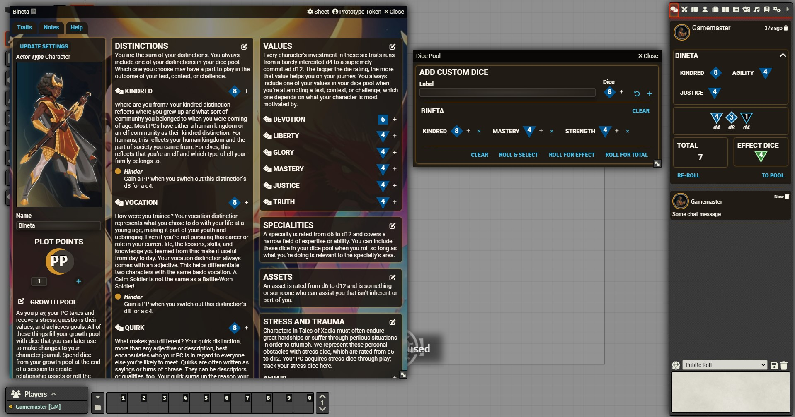

# tales-of-xadia-foundry-vtt-cortex-theme

A fan made module for Foundry VTT and the Cortex Prime game system that styles the character sheet to more closely resemble the official website.

## Installation:

Copy the manifest link into Foundry's module installation dialog:

TODO

## Background Art:

The default background image was created by [Dream AI](https://dream.ai/) and cropped in GIMP.

